# Architecture Diagrams — Logistics Platform

Companion to `AGENT.md`. Renders in any Mermaid-compatible viewer (GitHub, GitLab, VS Code w/ Mermaid extension, most modern editors). Each diagram covers one concern in isolation — read alongside `AGENT.md` for the capability matrix, schema, and API contract these diagrams visualize.

---

## 1. System context

Who/what talks to the platform, at the highest level.

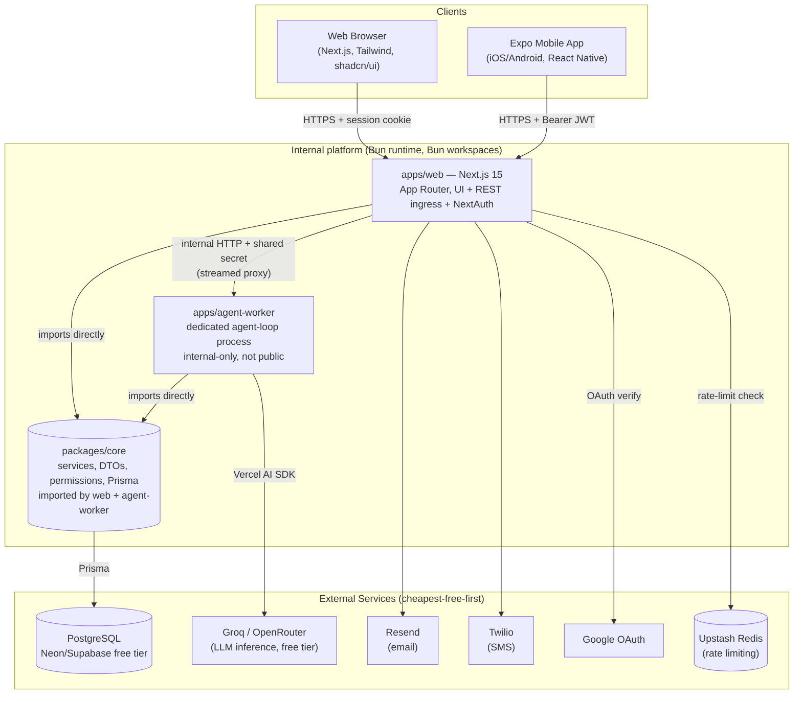

**Note:** `apps/agent-worker` has no public ingress of its own — every client (web or mobile) reaches it only by first going through `apps/web`, which resolves the actor and rate-limits before forwarding.

---

## 2. Request layering (every request, regardless of caller or process)

The core discipline: thin edges, one logic layer, one data layer. Applies identically whether the caller is a REST route (`apps/web`), a server action (`apps/web`), or an agent tool (`apps/agent-worker` — a different process, same rule).

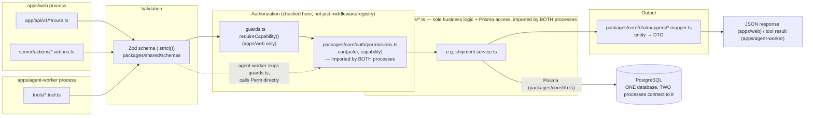

**Rule visualized:** if any box under "Callers" starts writing a Prisma query directly, that's the violation this diagram exists to catch — this now applies across a process boundary, not just a file boundary, which is exactly why `permissions.ts` and the services moved into `packages/core` rather than staying private to `apps/web`.

---

## 3. Auth flow — one NextAuth config, two transports

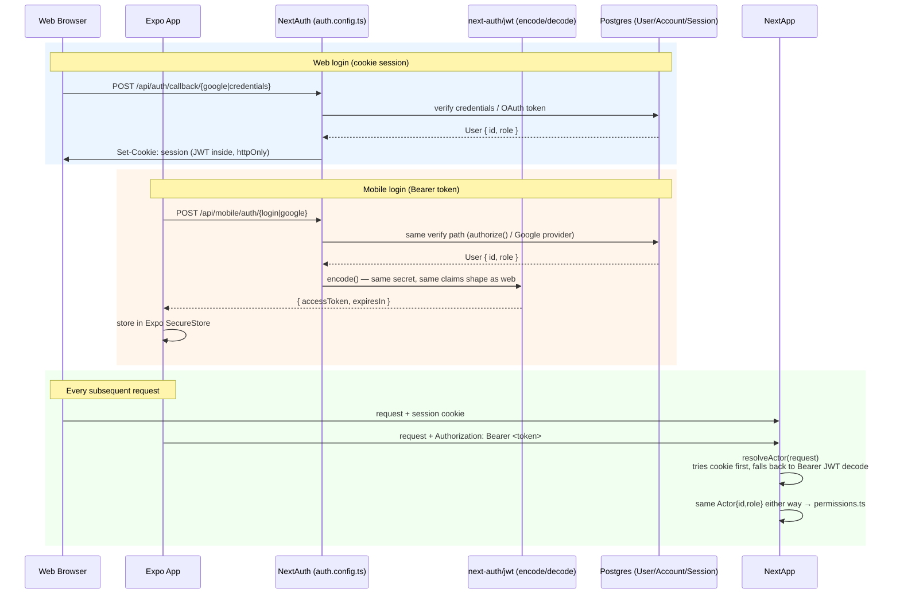

**Why one path, not two systems:** a bug fixed in `authorize()` or the Google verification logic is fixed for both platforms simultaneously — there's no second implementation to forget.

---

## 4. Role-scoped agent tool authorization (across the process split)

Three layers now, not two: the proxy boundary (`apps/web`'s internal-call authentication), registry filtering (what the model can even attempt), and the service-layer capability check (the actual security boundary — unchanged by the process split, just relocated to `packages/core`).

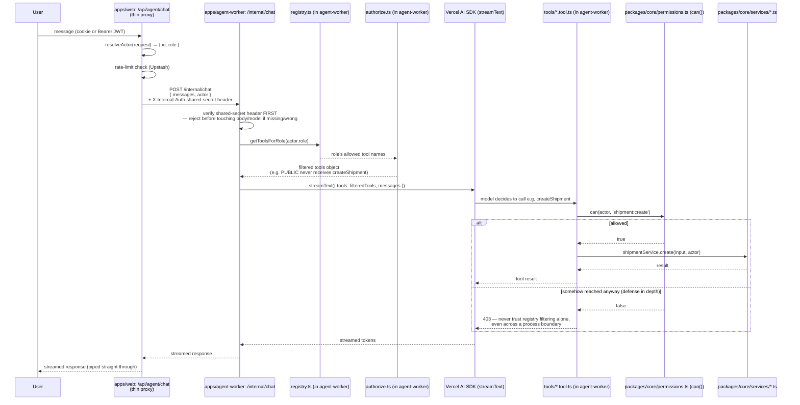

**Public tier tools (v1):** `getQuote`, `trackShipment`, `flagShipment` only — `createShipment`/`updateShipment`/`cancelShipment` never appear in this branch's registry entry, by construction, not by convention.

**New failure mode introduced by the split (and its mitigation):** `agent-worker` trusts `apps/web`'s `actor` assertion instead of re-verifying the end user's session itself — that trust is only safe because `apps/agent-worker` has no public ingress and the shared-secret header is checked before anything else runs. If either of those two facts ever stops being true, this diagram's trust boundary breaks.

---

## 5. Human-in-the-loop — agent action approval

Applies only when a gated tool (`createShipment`/`updateShipment`/`cancelShipment`) is called by an actor whose role is exactly `AGENT`. MANAGER+ callers skip this entirely (see note below the diagram).

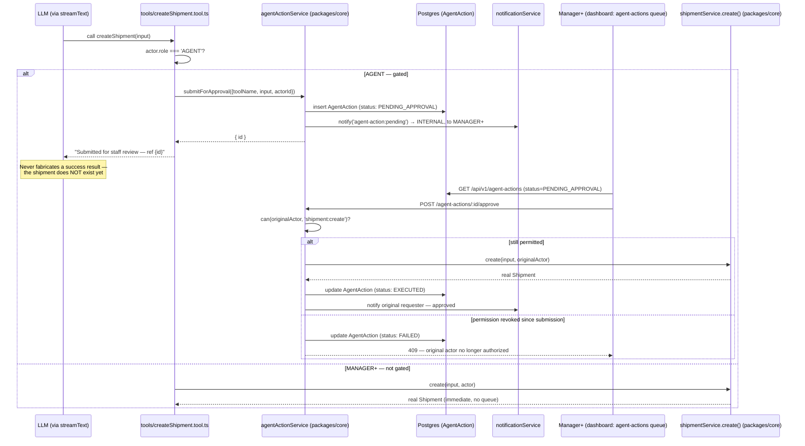

**Why MANAGER+ skips the queue:** this gate exists to catch natural-language misinterpretation risk specific to less-senior, customer-facing staff using the agent — it is not a second authorization check (that's `permissions.ts`'s job, unchanged). A Manager approving their own request would be a meaningless loop; the design avoids that by simply not queuing Manager+ actions in the first place, rather than adding a same-person-can't-approve rule to work around it.

---

## 6. Agent kill switch — dual independent check

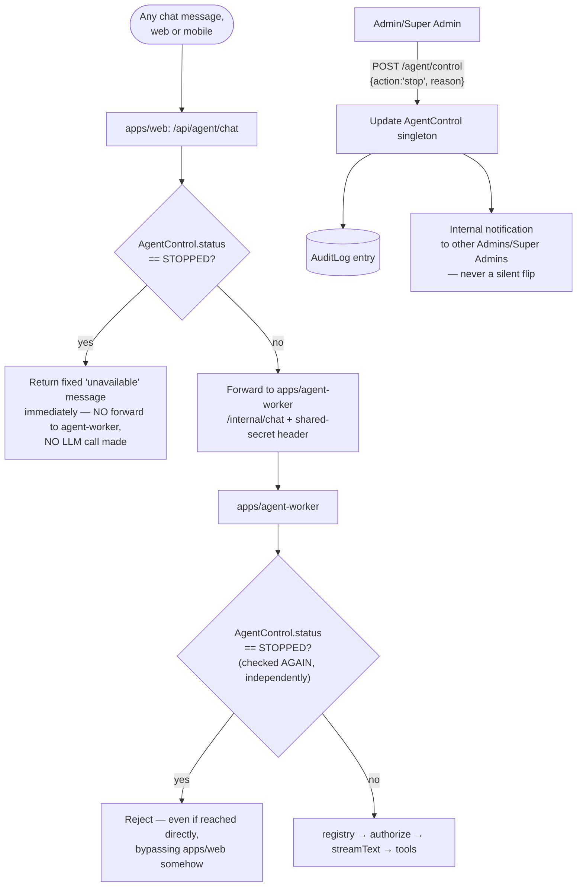

**Why check twice:** a single check point means one misconfiguration (a proxy bug, a bypassed route, direct network access to agent-worker despite the intent that it stay internal-only) makes the "stopped" agent live again. Two independent checks mean both would have to fail simultaneously — a materially different, much less likely failure mode.

---

## 7. Notification dispatch — one seam, three channels

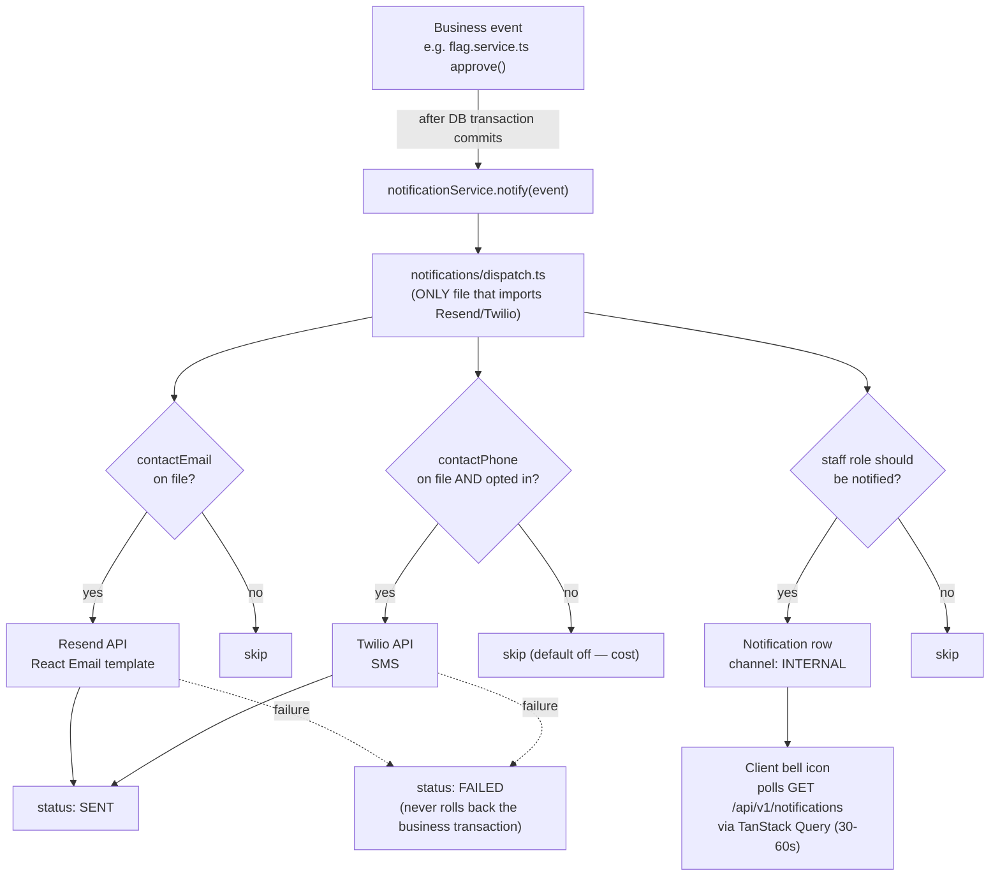

---

## 8. Data model (ER diagram)

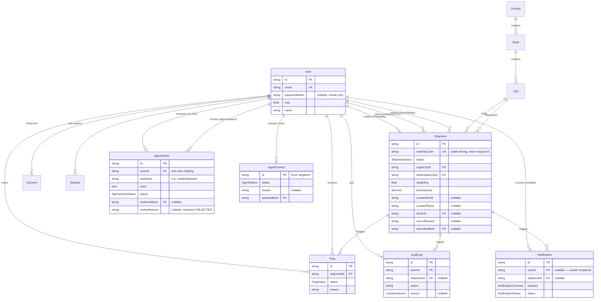

---

## 9. Shipment state machine

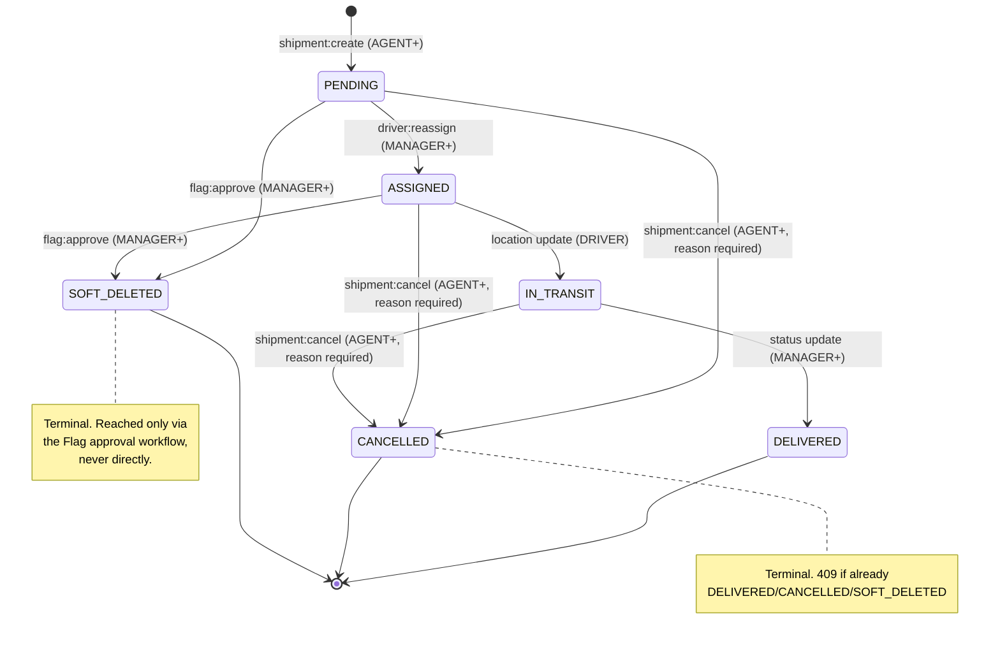

---

## 10. Flag approval state machine

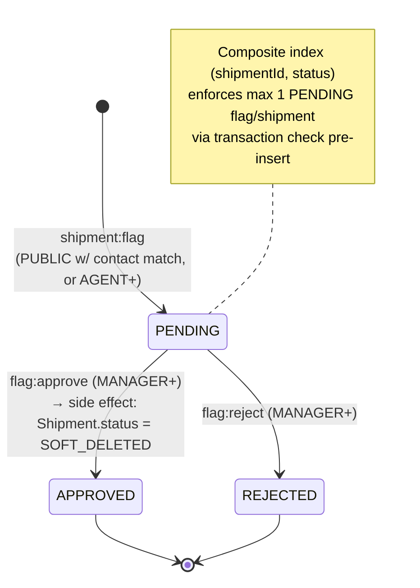

---

## 11. Monorepo layout

```mermaid
graph TB
    Root["logistics-platform/ (Bun workspaces root)"]
    Root --> Web["apps/web<br/>Next.js 15, App Router<br/>UI + REST ingress + NextAuth"]
    Root --> Worker["apps/agent-worker<br/>Bun HTTP server<br/>internal-only, not public"]
    Root --> Mobile["apps/mobile<br/>Expo, React Native"]
    Root --> Core["packages/core<br/>SERVER-ONLY: services, DTOs,<br/>permissions.ts, Prisma client"]
    Root --> Shared["packages/shared<br/>CLIENT-SAFE: Zod schemas,<br/>types, API client"]

    Web -- "imports (business logic)" --> Core
    Worker -- "imports (business logic)" --> Core
    Web -.->|imports| Shared
    Worker -.->|imports| Shared
    Mobile -.->|imports| Shared
    Mobile -. "NEVER imports<br/>(no DB creds in mobile bundle)" .-x Core

    Web --> WebApp["app/ — 3 route groups:<br/>(auth) (dashboard) (public)<br/>+ /api/agent/chat (thin proxy)"]
    Web --> WebServer["server/ — actions, auth.config,<br/>guards, agent-proxy/forward.ts"]
    Web --> WebComponents["components/ — ui, charts, shipment, agent-chat"]

    Worker --> WorkerEntry["index.ts — POST /internal/chat<br/>verifies shared-secret header first"]
    Worker --> WorkerTools["tools/*.tool.ts, registry.ts, authorize.ts"]

    Mobile --> MobileScreens["src/screens/ — mirrors web route groups,<br/>full dashboard parity"]
    Mobile --> MobileApi["src/api/client.ts — Bearer token wrapper<br/>calls apps/web ONLY, never agent-worker"]
    Mobile --> MobileCharts["victory-native chart components<br/>consuming same analytics DTOs as web Recharts"]

    Core --> CoreDb["db.ts — ONE Prisma client,<br/>both apps/web and apps/agent-worker connect to same Postgres"]
    Core --> CoreServices["services/ — shipment, quote, location,<br/>flag, user, notification, audit, analytics,<br/>agentAction, agentControl"]
    Core --> CorePerm["auth/permissions.ts — ⭐ capability matrix,<br/>needed by both processes hence lives here"]

    Shared --> SharedSchemas["schemas/ — one Zod source"]
    Shared --> SharedClient["api-client/ — typed fetch fns,<br/>platform-agnostic"]
```

**Why `packages/core` is server-only and `packages/shared` isn't:** `packages/core` holds the Prisma client and DB credentials — if `apps/mobile` ever imported it, database credentials would ship inside a mobile app bundle. `packages/shared` deliberately contains nothing that isn't safe to ship to a client, which is what makes it the one package all three apps can import without a security review every time.

---

## 12. Dashboard analytics data flow

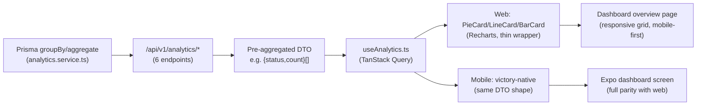

**Rule visualized:** charts never receive raw Prisma rows — only the pre-aggregated DTO. No client-side reduction, on either platform.
